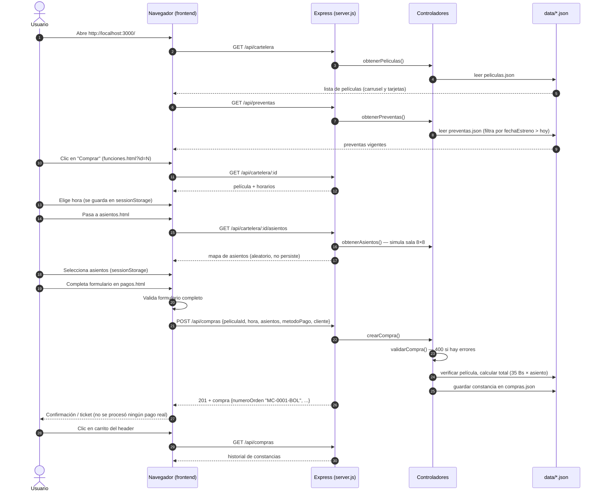

# Backend — Cartelera de Cine

Servidor en Node.js con Express que expone la API de la cartelera.

## Requisitos

- [Node.js](https://nodejs.org/) (v18 o superior recomendado)

## Instalación

Desde la carpeta `backend/`:

```bash
npm install
```

## Cómo correr el servidor

```bash
npm start
```

o directamente:

```bash
node server.js
```

El servidor queda escuchando en `http://localhost:3000`.

El servidor también sirve el frontend: abre `http://localhost:3000/` en el
navegador para ver la página principal con la cartelera y preventas cargadas
desde la API.

## Endpoints disponibles

| Método | Ruta                          | Descripción                                              |
|--------|-------------------------------|----------------------------------------------------------|
| GET    | `/api/cartelera`              | Lista de películas en cartelera                          |
| GET    | `/api/cartelera/:id`          | Una sola película (la usan funciones/asientos/pagos)     |
| POST   | `/api/cartelera`              | Agrega una película (con validación de campos)           |
| DELETE | `/api/cartelera/:id`          | Elimina la película con ese `id`                         |
| GET    | `/api/cartelera/:id/asientos` | Mapa de sala simulado (8 filas × 8 asientos)             |
| GET    | `/api/preventas`              | Preventas cuya fecha de estreno aún no llegó             |
| GET    | `/api/compras`                | Lista de compras registradas (las muestra el carrito)    |
| GET    | `/api/compras/:id`            | Una compra (la usa la pantalla de confirmación)          |
| POST   | `/api/compras`                | Registra una compra mock: valida datos, **no procesa pago** |

El campo `formato` de películas y preventas acepta: `2D`, `2D XL`, `3D`, `2D SUB`.

## Flujo completo de una compra

El frontend acarrea la selección (`peliculaId`, `hora`, `asientos`) en
`sessionStorage` entre pantallas; el backend solo persiste algo al final,
en el `POST /api/compras`.



## Manejo de errores

- **400** — Datos inválidos en el POST (devuelve la lista de errores en `detalles`).
- **404** — Ruta o película inexistente.
- **500** — Error interno: `{ "error": "Error interno del servidor" }`

## Estructura

```
backend/
├── server.js                  # Punto de entrada: Express, estáticos, middleware y errores
├── routes/
│   ├── cartelera.js           # Router de /api/cartelera
│   ├── preventas.js           # Router de /api/preventas
│   └── compras.js             # Router de /api/compras
├── controllers/
│   ├── peliculas.js           # Lógica de películas, validación y simulación de asientos
│   ├── preventas.js           # Lógica de preventas (disponibilidad por fecha)
│   └── compras.js             # Lógica de compras mock (validación y constancias)
├── data/
│   ├── peliculas.json         # Persistencia de películas en cartelera
│   ├── preventas.json         # Próximos estrenos / preventas
│   └── compras.json           # Constancias de compras (mock, sin datos de tarjeta)
└── package.json
```
